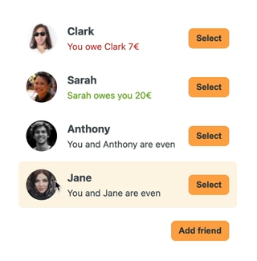

## Application de Partage d'Addition au Restaurant

**Objectif :**
Créer une application React qui permet aux utilisateurs de saisir le coût total d'un repas au restaurant et de le diviser spécifiquement avec un ami.

### A FAIRE:
- [ ] la possibilité d'ajouter un ami

                                                               

- [ ] faire une trascation avec Anthony

- [ ] les différentes section de l'application

